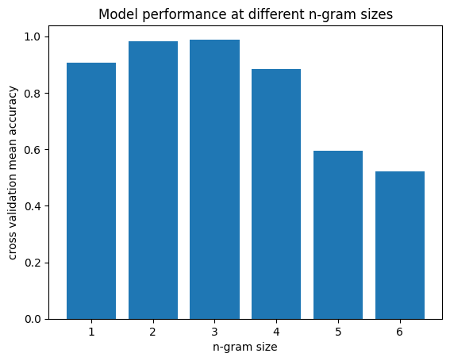

# Distinguishing Human and GPT-generated Text Using Only Syntax Information
*Includes data from the following study: https://pubmed.ncbi.nlm.nih.gov/37903836/*

With AI-generated content everywhere, it can be hard to know whether or not something was made by an actual person, and it’s important to know what cues to look out for that can help differentiate them. In my experience, when it comes to GPT-generated text, this is not too difficult. I’ve been using ChatGPT since it came out, and from reading so much of its output, I’ve kind of developed this sense of familiarity: anytime I see it out in the wild, it’s almost like running into an old friend– I just can’t help but notice it.

Still, while it’s easy to go off of intuition, it’s hard to pinpoint the exact “markers” of GPT-generated text. Vocabulary is certainly a key part of that: GPT has some [characteristic words that it overrepresents](https://arxiv.org/abs/2412.11385) (delve, tapestry, underscore), and [overall uses a richer vocabulary than humans do](https://arxiv.org/html/2503.13687v1).

However, I’ve always had the intuition that this issue goes deeper than vocabulary differences (lexical semantics) and exists in **structural differences** (syntax) of text. It almost seems like GPT has a cookie-cutter “template” to conform to, regardless of the words it chooses. This raises an interesting (and somewhat confusing) question: *Relying solely on syntactic information, could we still differentiate human and GPT-generated text?* Or in other words, even if we stripped away the lexical information and thus ruled-out vocab differences, could we still tell them apart?

## Concept

One basic way to visualize the bare structure of a text is to simply examine the parts of speech of each word. For example:

`The quick brown fox jumped over the lazy dog.`

`DET ADJ ADJ NOUN VERB-PAST PREP DET ADJ NOUN PERIOD`

Thus, we turn a sentence into a list of POS (part of speech) tags. This would be a word-level syntax analysis of sentences, which unfortunately means it misses out on things like dependencies and structural hierarchy. However, there is still valuable information and features to extract from this data. We can look at the **part-of-speech n-grams**, which are sequences of `n` POS tags. If it’s true that human and GPT-generated text have structural differences (differences beyond vocabulary), it could be expected that the frequencies of POS n-grams should differ between them.

## Task

The goal then is to determine whether a basic ML model can differentiate human and GPT-generated text using only word-level syntax information (POS tags) by comparing n-gram frequencies.

## Data

I will use [this dataset](https://pubmed.ncbi.nlm.nih.gov/37903836/) from a study in 2023 that has human, GPT-3, and GPT-4 written essays to 91 different prompts. It includes [SpaCy](https://spacy.io/)-generated POS tags, which is the only data that the model will be allowed to see. For this project, I’ll exclude GPT-3 from analysis because it’s an older model and I’m less familiar with it at this point.

## Method

For each written essay (rather, the POS tag sequences of the essays), I will gather n-gram frequency data, which will be the actual training and testing data for the model. The model will be a basic logistic regression classifier, which is useful because it can reveal which n-grams have the most weight in the classification decisions.

I will make a classifier that compares unigram frequency (meaning, the frequencies of each POS tag), one for bigram frequency (the frequencies of each POS tag pair), and one for each increasing value of `n`, until the model accuracy levels off.

Since 91 essays is not that much data, to avoid overfitting, the metric for this test will be the mean accuracy from 5-fold cross validation.

## Hypotheses

### *Will the model succeed for any value of `n`?* 

I expect that for at least a few values of `n`, particularly `n=3` and `n=4`, the model will find some structural patterns that differentiate human and GPT text.

### *What is the optimal value of `n`*? 

Increasing the value of `n` comes with a trade off. If `n=1`, for instance, the model will not be able to observe syntax structure or relationships between words– it will only observe the frequencies of parts of speech. However, it will most likely have many occurrences of nouns, verbs, adjectives, etc. and the resulting data for one essay will be fairly generalizable to other essays.

As `n` increases, the model will be able to find patterns between words, which means it can make estimations based on larger syntactic structures. However, the number of n-grams increases exponentially as `n` increases, and for high values of `n` (e.g. `n>5`), the frequencies of each n-gram will be extremely low, with most only showing up once or twice in a given essay. Thus, the data would not likely generalize to other essays.

This can be summarized as a bias-variance tradeoff: with low values for `n`, bias is high and variance is low; with high values for `n`, bias is low and variance is high.

I expect that `n=3` or `n=4` will be the optimal values. The n-grams won’t be too infrequent, and they will also reveal structural patterns that can help differentiate human and GPT text.

### *What n-grams are the most important in classification?*

There are certain POS tag patterns that I would expect to see as good predictors of human and GPT-generated text:
Humans should use more personal pronouns, particularly “I.”
GPT seems to use description words a lot more (adjectives and adverbs)
GPT uses lists often, so I would expect to see more commas and structures like `NOUN COMMA NOUN COMMA COOR-CONJUNCTION NOUN`
`COMMA VERB-GERUND`: GPT often uses verb gerunds after clauses; for instance: “The dog slept**, offering** a fun jumping challenge for the fox.”
`PERIOD PREP VERB-GERUND`: GPT starts a lot of sentences with a preposition and a gerund; for instance: “**By providing** a safe environment…”

The latter two items are ones that I am particularly curious about, because I personally observe them all the time, and I find them to be pretty characteristic of GPT.

## Results

*Cross validation accuracy is highest for trigrams, at 96%.*

Accuracy is already high (83%) for unigrams. It is very high for bigrams (94%) and highest for trigrams (96%). It declines at 4-grams (81%) and settles to around chance (50%) for 5-grams and 6-grams. 

Interestingly, for all n-gram sizes except `n=1`, the model’s precision for human guesses and recall for GPT guesses were 100%, meaning it was over-guessing GPT and under-guessing human. My assumption is that, while there are a variety of human participants who may write differently from one another, there is only one GPT “writer”– meaning GPT outputs were probably much more consistent and recognizable than human outputs.

### Characteristic N-grams for GPT-4 and Humans (based on logistic regression coefficients)

| **Unigram**              |       | **Bigram**     |       | **Trigram**         |       |
|--------------------------|-------|----------------|-------|----------------------|-------|
| **GPT**                  | **Human** | **GPT**     | **Human** | **GPT**             | **Human** |
| JJ (adjective)           | PRP (personal pronoun) | , CC           | , PRP         | NN , CC           | PRP RB VBP         |
| VBG (verb gerund)        | RB (adverb)            | , VBG          | IN DT         | NNS , VBG         | MD VB VBN          |
| CC (coordinating conj.)  | MD (modal/aux verb)    | JJ NN          | VB VBN        | , CC JJ           | PRP MD VB          |
| NN (noun)                | JJS (superlative adj.) | CC JJ          | NN RB         | . IN VBG          | RB , IN            |
| , (comma)                | VBD (past tense verb)  | VBG NNS        | PRP MD        | CC JJ NN          | RB , PRP           |

There’s a lot of information from this table and a lot of possible conclusions to draw from this, but here are some highlights I notice:
GPT is characterized by more adjectives (expected) and verb gerunds (also expected).
The `, VBG` and `. IN VBG` patterns stand out to me in particular, as explained before.
Humans use more personal pronouns, as expected.
Humans use more modal/auxiliary verbs. This might be an issue of *certainty*- maybe humans make more suggestions and opinionated statements (might, may, could, should) than GPT does.
Lists seem to be a big part of GPT’s characteristic: commas show up in its n-grams a lot more. Note the `NN , CC` which likely represents the ending of a list of nouns.
Humans use more adverbs- this was not expected. I thought I observed adverbs more in GPT. There are a lot of more common adverbs that don’t end in the typical “-ly”, like “more” and “much”, so that might be why I didn’t notice.
The `RB , IN` and `RB , PRP` are likely conjunctive adverbs at the starts of sentences, like “However, …” or “Firstly, …”. I would have expected that GPT uses these more, since these are very “cookie cutter” parts of essays, but it makes sense that humans would use them too.

## Conclusion

The main takeaway from this project is that it is possible (and relatively easy) to distinguish human and GPT-generated texts, *even when vocabulary differences are ruled out*. Thus, there are in fact syntactic markers that can differentiate the two.

The methods used in this project (n-gram frequency analysis and basic logistic regression) are rather simple, which means two things. Firstly, it is surprising that such high accuracy was achieved with relatively simple models, and it suggests that the differences in syntax between human and GPT output are rather obvious and uncomplicated. Secondly, it raises the question as to what distinguishing patterns the project misses out on. It would be interesting to see how human and GPT syntaxes could be compared by looking at larger structures (syntax trees or dependencies) or by looking at different levels of syntactic analysis (clause level, sentence level, paragraph level, etc.).

Additionally, this text data comes from GPT-4 output from 2023. The models have changed and improved significantly since then, and might resemble human patterns much more than before. By the time GPT-5 comes out, who knows if we’ll still be able to tell the difference!
